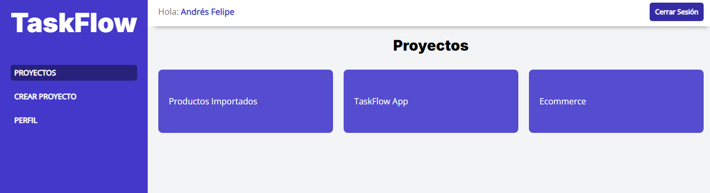
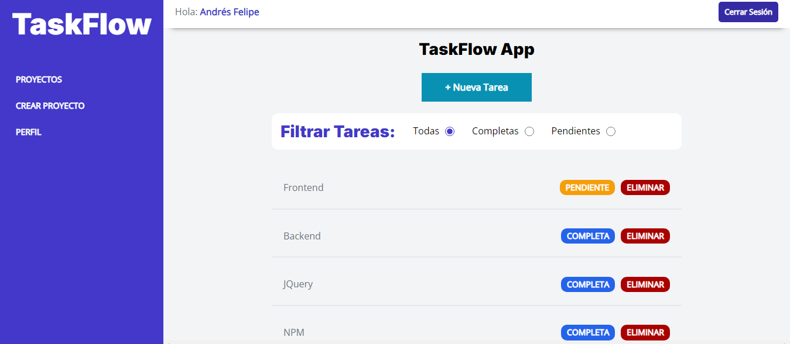

# TaskFlow

**TaskFlow** es una plataforma avanzada de gestión de proyectos que utiliza los últimos estándares tecnológicos para ofrecer una experiencia de usuario óptima. Diseñada para tener un gran impacto social y tecnológico, **TaskFlow** facilita la planificación, el seguimiento y la colaboración en proyectos, permitiendo a los equipos trabajar de manera más eficiente y efectiva en la consecución de sus objetivos.

## Capturas de Pantalla

## Funcionalidades

- **Gestión de Tareas:** Creación, asignación y seguimiento de tareas individuales y grupales con opciones de prioridad y plazos.
- **Colaboración en Equipo:** Espacios de trabajo compartidos que permiten la comunicación y colaboración entre miembros del equipo en tiempo real.
- **Monitoreo en Tiempo Real:** Paneles de control interactivos que muestran el progreso del proyecto y las tareas en tiempo real.
- **Seguridad de Datos:** Implementación de los más altos estándares de seguridad y privacidad para proteger la información sensible de los proyectos.
- **Escalabilidad:** Capacidad de adaptarse a proyectos de diferentes tamaños y complejidades, desde pequeños equipos hasta grandes organizaciones.
- **Interfaz Intuitiva:** Diseño amigable y fácil de usar que facilita la adopción de la plataforma por parte de usuarios con diferentes niveles de experiencia.
- **Impacto Social:** Funcionalidades orientadas a proyectos con un enfoque en la responsabilidad social, fomentando prácticas sostenibles y colaborativas.

## Tech Stack

**Fronend:** HTML, CSS, SCSS, JAVASCRIPT

**Backend:** PHP

**Almacenamiento:** MYSQL, MARIADB

## **TaskFlow** Colores Principales

| Color             | Hex                                                                |
| ----------------- | ------------------------------------------------------------------ |
| Indigo | #4338CA
| Cyan | #0891B2
| Morado | #7C3AED
| Naranja | #F59E0B |
| Rosa |  #DB2777 |
| Blanco |  #FFFFFF |
| Gris |  #6b7280 |
| GrisOscuro |  #4B5563 |
| GrisClaro |  #f3f4f6 |
| Negro |  #000 |

## Autor

- [@Pipepena2979/](https://github.com/Pipepena2979)

